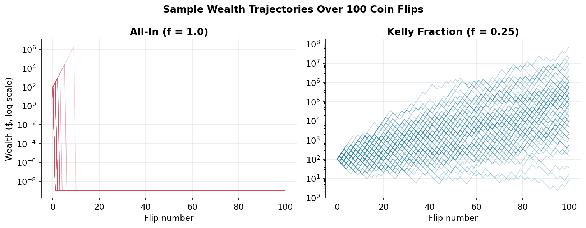
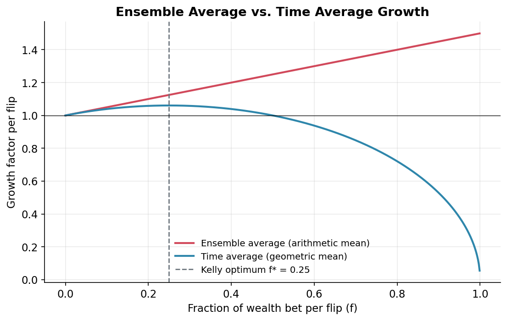
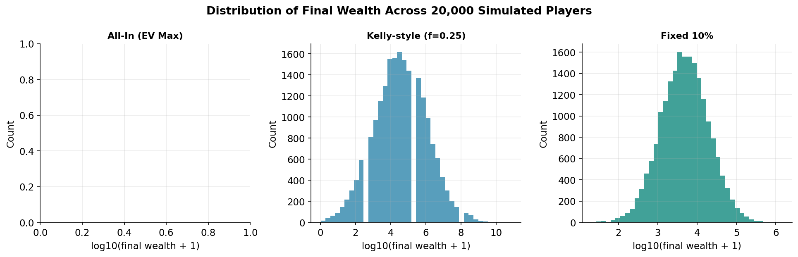
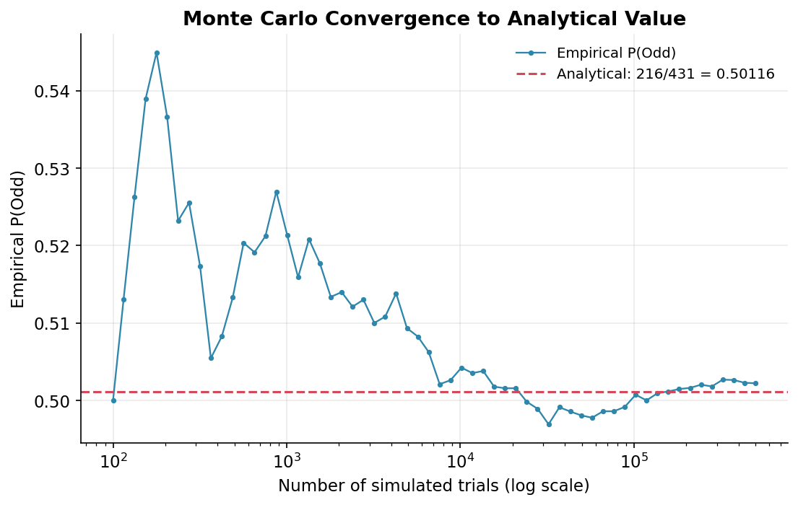
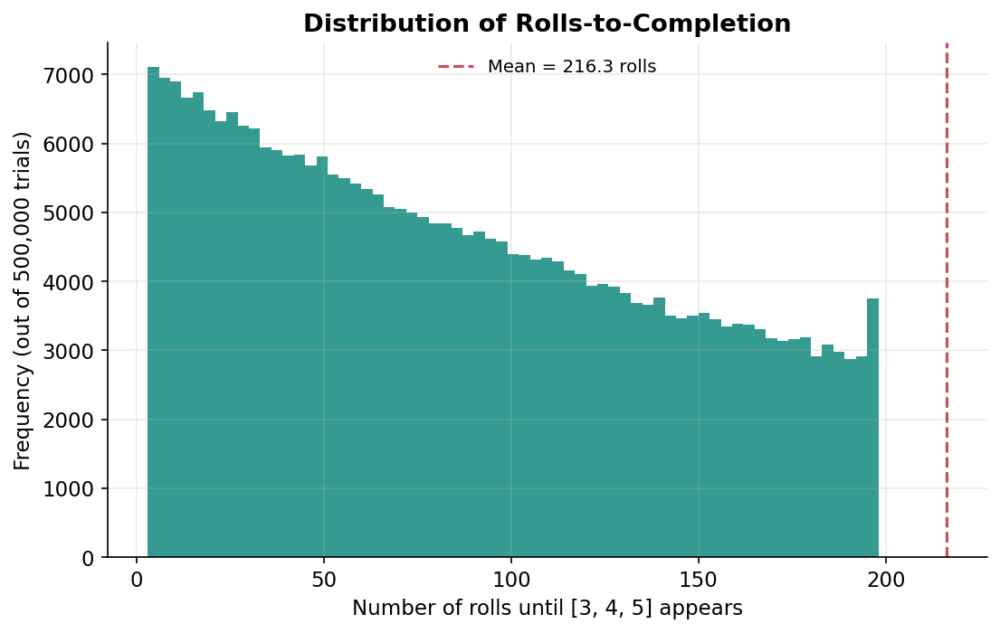

# quant-brainteasers-sim

**Exact analytical solutions + large-scale Monte Carlo validation for two classic quant-interview probability brainteasers**, combining mathematical modeling, simulation, and data visualization in clean, tested, object-oriented Python.

[](.github/workflows/ci.yml)
[](pyproject.toml)
[](LICENSE)

| Problem | Module | Headline Result |
|---|---|---|
| **The Coin Betting Dilemma** | [`src/betting_game.py`](src/betting_game.py) | EV-maximizing all-in strategy has expected wealth ≈ **4.07 × 10¹⁹** but a **~100% probability of ruin** |
| **The `[3, 4, 5]` Dice Sequence** | [`src/dice_sequence.py`](src/dice_sequence.py) | $P(\text{Odd}) = \dfrac{216}{431} \approx \mathbf{0.50116}$ |

---

## Table of Contents

1. [Project Overview & Motivation](#1-project-overview--motivation)
2. [Mathematical Derivations](#2-mathematical-derivations)
   - [2.1 The Coin Betting Dilemma](#21-the-coin-betting-dilemma)
   - [2.2 The `[3,4,5]` Dice Sequence](#22-the-3-4-5-dice-sequence)
3. [Results: Theoretical vs. Monte Carlo](#3-results-theoretical-vs-monte-carlo)
4. [Visualizations](#4-visualizations)
5. [Key Insights](#5-key-insights)
6. [Repository Structure](#6-repository-structure)
7. [How to Run](#7-how-to-run)
8. [Testing & CI](#8-testing--ci)
9. [Requirements](#9-requirements)
10. [License](#10-license)

---

## 1. Project Overview & Motivation

Both problems are famous in quant-interview circles because the "obviously correct" answer — maximize expected value; guess $P(\text{Odd}) \approx 0.5$ by symmetry — is subtly wrong, and the reasons why are foundational to quantitative finance:

- **Problem 1** illustrates the gap between the **ensemble average** (what expected-value math says) and the **time average** (what actually happens to a single wealth path over time) — the central idea of *ergodicity economics* and the motivation for the **Kelly Criterion**. It's the same reasoning that explains why no rational trader sizes positions purely to maximize expected value without regard to variance and compounding.
- **Problem 2** demonstrates **absorbing Markov chains** and how a first-step / parity decomposition turns a combinatorially awkward question ("on which roll does a pattern first appear?") into a solvable linear system. It also shows why *self-overlapping* patterns require the same machinery used in the **Knuth-Morris-Pratt (KMP)** string-matching algorithm.

This repository implements both problems as clean, fully tested, object-oriented Python modules, validates every analytical result against large-scale Monte Carlo simulation, and visualizes the results in a runnable Jupyter notebook.

---

## 2. Mathematical Derivations

### 2.1 The Coin Betting Dilemma

**Setup.** Start with $W_0 = \$100$. Flip a fair coin $n = 100$ times. On each flip, wager $B \le W_t$ (current wealth). A win pays $2B$ profit (wealth becomes $W_t + 2B$); a loss costs $B$ (wealth becomes $W_t - B$).

**Single-flip expected value.**

$$
\mathbb{E}[\Delta W] = \tfrac{1}{2}(2B) + \tfrac{1}{2}(-B) = \tfrac{1}{2}B
$$

Strictly increasing in $B$ ⟹ the **EV-maximizing** fraction of wealth to bet every flip is $f^\* = 1.0$ (bet everything).

**Expected terminal wealth, all-in.** A single loss brings wealth to exactly $0$ (absorbing), so after $n$ flips:

$$
\mathbb{E}[W_n] = \left(\tfrac12\right)^n \big(W_0 \cdot 3^n\big) + \left(1-\left(\tfrac12\right)^n\right)\cdot 0 = W_0\left(\tfrac32\right)^n
$$

For $W_0=100,\ n=100$: $\mathbb{E}[W_{100}] \approx 4.0656\times10^{19}$.

**Probability of ruin.**

$$
P(\text{ruin}) = 1 - \left(\tfrac12\right)^{100} \approx 0.999999999999999999999999999999
$$

Practically certain bankruptcy despite an astronomically large expected value — the central paradox of the problem.

**Ergodicity / Kelly Criterion.** For a fixed-fraction strategy betting fraction $f$, the per-flip growth factor is $(1+2f)$ on a win, $(1-f)$ on a loss. The **ensemble average** growth factor:

$$
\mathbb{E}[\text{growth}] = \tfrac12(1+2f) + \tfrac12(1-f) = 1 + \tfrac12 f \quad \text{(maximized at } f=1\text{)}
$$

But wealth compounds *multiplicatively*, so what an investor actually experiences is the **geometric-mean (time-average) growth rate**:

$$
G(f) = \left[(1+2f)(1-f)\right]^{1/2}
$$

For a bet paying $b{:}1$ with win probability $p$ (here $b=2,\ p=q=0.5$), the **Kelly-optimal fraction** is:

$$
f^\*_{\text{Kelly}} = p - \frac{q}{b} = 0.5 - \frac{0.5}{2} = 0.25
$$

At $f=1$, $G(1)=0$ — the time-average growth rate of the "EV-maximizing" strategy is exactly **zero** (certain eventual ruin), while $f=0.25$ maximizes long-run compounded growth.

### 2.2 The `[3, 4, 5]` Dice Sequence

**Setup.** Roll a fair six-sided die repeatedly until $[3,4,5]$ appears in three consecutive rolls. Find $P(\text{Odd})$: the probability the sequence first completes on an odd-indexed roll.

**Markov chain.** Three transient states plus one absorbing state:

| State | Meaning |
|---|---|
| 0 | No progress |
| 1 | Last roll was `3` |
| 2 | Last two rolls were `3, 4` |
| 3 (absorbing) | `3, 4, 5` observed |

| From \ Roll | → State 0 | → State 1 | → State 2 | → State 3 |
|---|---|---|---|---|
| State 0 | 5/6 (not 3) | 1/6 (roll 3) | — | — |
| State 1 | 4/6 (not 3,4) | 1/6 (roll 3) | 1/6 (roll 4) | — |
| State 2 | 4/6 (not 3,5) | 1/6 (roll 3) | — | 1/6 (roll 5) |

**Parity linear system.** Let $p_i$ = probability of odd-roll completion starting fresh from state $i$. Each transition consumes exactly one roll (flips parity), giving $p_i = \sum_j T_{ij}(1-p_j) + a_i$. Clearing denominators:

$$
\begin{aligned}
11p_0 + p_1 &= 6\\
4p_0 + 7p_1 + p_2 &= 6\\
4p_0 + p_1 + 6p_2 &= 6
\end{aligned}
$$

Solved exactly via Gaussian elimination over rational numbers (`DiceSequenceAnalytics.solve_exact`):

$$
P(\text{Odd}) = p_0 = \frac{216}{431} \approx 0.50116009280742\ldots
$$

**Generalization.** For self-overlapping targets (e.g. `[6, 6]`), the naive "reset to state 0 or 1" logic above is *not* generally correct — the **KMP failure function** is needed to compute the correct fallback state when a roll breaks a partial match. `GeneralizedSequenceSolver` builds this automaton for any sequence and any number of die faces, then solves $(I + T)p = \text{rowsum}(T) + a$ via `numpy.linalg.solve`.

---

## 3. Results: Theoretical vs. Monte Carlo

*(Actual output from this codebase — see [`scripts/generate_readme_assets.py`](scripts/generate_readme_assets.py) and the notebook to reproduce.)*

### Coin Betting Dilemma (100,000 simulated players, 100 flips)

| Strategy | Analytical Mean | Simulated Mean | Simulated Median | P(Ruin) |
|---|---|---|---|---|
| **A: All-In** ($f=1.0$) | $\approx 4.07\times10^{19}$ | $\$0$ (dominated by float rounding of a $2^{-100}$-probability event) | $\$0$ | **100%** |
| **B: Kelly** ($f=0.25$) | grows at rate $G(0.25)$ | $\approx \$10{,}718{,}525$ | $\approx \$36{,}110$ | **0%** |
| **C: Fixed 10%** ($f=0.10$) | grows at rate $G(0.10)$ | $\approx \$13{,}170$ | $\approx \$4{,}690$ | **0%** |

> The all-in strategy's simulated mean rounds to \$0 across any *finite* sample of 100,000 players because the winning path has probability $2^{-100}\approx 8\times10^{-31}$ — you would need far more players than exist in the observable universe to expect to see it even once. The astronomical analytical EV is real, but is carried entirely by a practically unobservable event, which is exactly the point of the exercise.

### `[3, 4, 5]` Dice Sequence

| Quantity | Analytical (Exact) | Monte Carlo (500,000 trials) |
|---|---|---|
| $P(\text{Odd})$ | $216/431 \approx 0.5011601$ | $\approx 0.5022$ |
| Mean rolls to completion | $6^3 = 216$ | $\approx 216$ |

Run the notebook to regenerate this table with fresh random seeds / larger sample sizes.

---

## 4. Visualizations

**Wealth trajectories, log scale — All-In vs. Kelly fraction (80 sample paths each):**



Nearly every all-in trajectory collapses to \$0 within the first few flips (a single loss is fatal), while Kelly-fraction trajectories show a wide spread of outcomes and consistent long-run growth.

**Ensemble average vs. time average growth rate:**



The ensemble average (red) is maximized at $f=1$ — exactly why naive EV maximization says "bet everything." The time-average / geometric growth rate (blue) peaks at the Kelly fraction $f^\*=0.25$ and collapses to zero at $f=1$.

**Distribution of final wealth across strategies (20,000 players):**



**Monte Carlo convergence to the analytical dice-sequence answer:**



**Distribution of rolls needed to complete `[3, 4, 5]`:**



---

## 5. Key Insights

- **Kelly Criterion.** Maximizing expected value and maximizing long-run growth rate are *different objectives* whenever wealth compounds multiplicatively. The Kelly fraction ($f^\*=0.25$ here) maximizes $\mathbb{E}[\log W_n]$ — equivalent to maximizing the *median* / almost-sure long-run growth of terminal wealth, not its mean.
- **Risk of Ruin & Ergodicity.** A strategy can have unbounded expected value and still be almost-surely catastrophic for any individual path — the practical argument against "bet the farm" position sizing in trading, regardless of how favorable the odds look in expectation.
- **Markov States & Absorption.** Pattern-matching problems ("when does event X first happen") are naturally modeled as absorbing Markov chains. The parity trick — tracking "P(absorbed on odd step)" as its own linear system — sidesteps summing an infinite series directly.
- **Self-Overlap Matters.** Naively assuming "a broken match always resets to state 0 (or state 1 if the new roll matches the first symbol)" is only valid for non-self-overlapping sequences like `[3,4,5]`. Sequences like `[6,6]` need the KMP failure function to compute fallback states correctly — otherwise the model silently gives a wrong answer.

---

## 6. Repository Structure

```
quant-brainteasers-sim/
├── README.md
├── LICENSE
├── pyproject.toml
├── requirements.txt
├── .gitignore
├── .github/
│   └── workflows/
│       └── ci.yml              # Runs the test suite on every push/PR
├── assets/                     # Generated charts embedded in this README
├── scripts/
│   └── generate_readme_assets.py
├── src/
│   ├── __init__.py
│   ├── betting_game.py         # Problem 1: analytics, simulation, ergodicity
│   └── dice_sequence.py        # Problem 2: analytics, generalized solver, Monte Carlo
├── notebooks/
│   └── quant_analysis.ipynb    # Runs simulations & generates all charts interactively
└── tests/
    ├── test_betting.py
    └── test_dice.py
```

---

## 7. How to Run

### Installation

```bash
git clone <this-repo-url>
cd quant-brainteasers-sim
python -m venv .venv
source .venv/bin/activate        # Windows: .venv\Scripts\activate
pip install -r requirements.txt
```

Or, as an installable package (uses `pyproject.toml`):

```bash
pip install -e ".[dev]"
```

### Running the unit tests

```bash
pytest tests/ -v
```

### Regenerating the README charts

```bash
python scripts/generate_readme_assets.py
```

### Running the full analysis notebook

```bash
jupyter notebook notebooks/quant_analysis.ipynb
```

### Quick start from Python

```python
from src.betting_game import BettingAnalytics, CoinBettingSimulator, default_strategies

analytics = BettingAnalytics(initial_wealth=100.0, num_flips=100)
print(analytics.summary())

sim = CoinBettingSimulator(initial_wealth=100.0, num_flips=100, seed=42)
results = sim.compare_strategies(default_strategies(), num_players=100_000)
for name, res in results.items():
    print(name, res.summary())
```

```python
from src.dice_sequence import DiceSequenceAnalytics, DiceSequenceSimulator, GeneralizedSequenceSolver

print(DiceSequenceAnalytics().summary())                       # exact 216/431
print(GeneralizedSequenceSolver([1, 2, 3, 4], num_faces=6).solve())  # any sequence

sim = DiceSequenceSimulator(seed=42)
result = sim.run(sequence=[3, 4, 5], num_trials=1_000_000)      # ~7s, vectorized
print("Empirical P(Odd):", result.empirical_p_odd)
```

---

## 8. Testing & CI

- **41 unit tests** across both modules (`tests/test_betting.py`, `tests/test_dice.py`), covering analytical correctness, simulator invariants (e.g. wealth never negative, probabilities sum to 1), edge cases, and Monte Carlo convergence within tolerance.
- **Continuous Integration** via GitHub Actions ([`.github/workflows/ci.yml`](.github/workflows/ci.yml)) runs the full test suite on Python 3.10, 3.11, and 3.12 on every push and pull request.

```bash
pytest tests/ -v
# ============================== 41 passed ==============================
```

---

## 9. Requirements

See [`requirements.txt`](requirements.txt):

- `numpy`, `pandas` — numerical computation & data handling
- `matplotlib`, `plotly` — static and interactive visualization
- `scipy` — supplementary numerical routines
- `pytest` — unit testing
- `jupyter`, `nbformat` — running the analysis notebook

---

## 10. License

Released under the [MIT License](LICENSE) — an educational / portfolio project demonstrating quantitative modeling, simulation, and software engineering practices.
